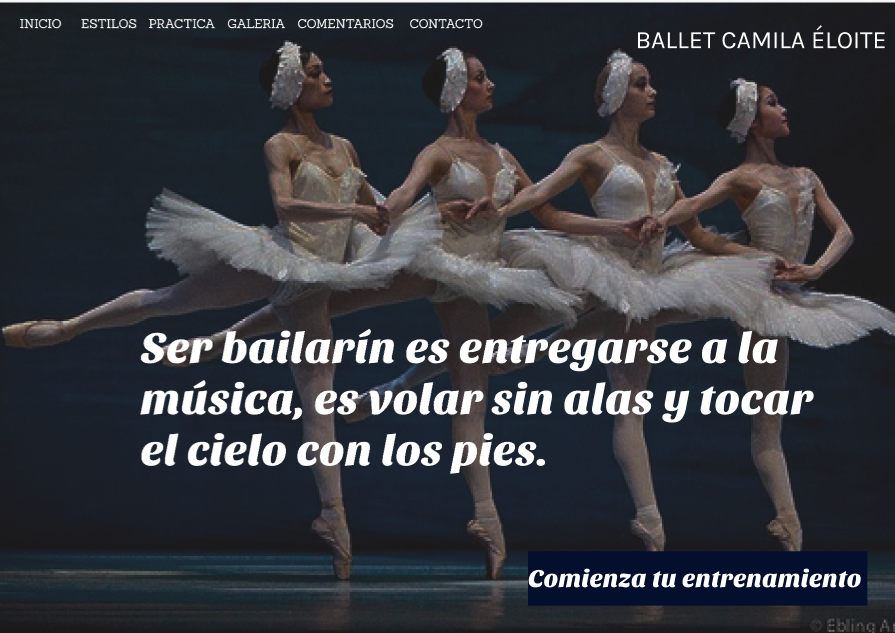

# 🩰 Ballet Camila Eloite
**Sitio web en vivo:**  
🌐 [https://camilaflorez12.github.io/ballet-camila-eloite/](https://camilaflorez12.github.io/ballet-camila-eloite/)

---

## 🎯 Descripción del Proyecto

Este proyecto es una página web diseñada para brindar información sobre el mundo del ballet. Fue desarrollada utilizando **HTML5** y **CSS3**, y organizada para mostrar secciones como una bienvenida, estilos de ballet y un sistema de enseñanza interactivo (simulación de una API).Además brinda información sobre las obras más importantes en la historia del ballet.

Está orientada a quienes desean iniciarse en esta disciplina artística, ofreciendo contenido inspirador y educativo.

---

## 🛠️ Tecnologías Utilizadas

- `HTML5`: estructura y contenido.
- `CSS3`: diseño y estilos visuales.
- `JavaScript`:para agregar interactividad como validación de formularios, animaciones suaves y mensajes dinámicos.
- `GitHub Pages`: para la publicación del sitio.

---

## 🧭 Navegación del Sitio

El sitio contiene las siguientes secciones/páginas:

1. **Inicio**  
   - Imagen inspiradora.
   - Mensaje de bienvenida.
   - Barra de navegación.

2. **Estilos de Ballet**  
   - Descripción de estilos: clásico, contemporáneo, neoclásico, etc.

3. **API de Enseñanza (ballet)**  
   - Videos traidos del api "youtube data api v3"
4. **Galeria obras mas importantes**
   - Información de las obras más importantes en el ballet.
5. **Comentarios**
   - Comentarios de personas que han usado página web.
   - Formulario donde se pueden dejar comentarios sobre la página web.
6. **Contacto**
   - Mapa de ubicación.
   - Contactos.
---

## 🖼️ Vista previa del diseño

### 📸 Capturas de pantalla

👉 [Haz clic aquí para ver el diseño completo en Figma](https://www.figma.com/design/tdbwcx8uqFA1bfWPZVJITh/Sin-t%C3%ADtulo?node-id=0-1&t=FU4PwPslRLuPJ7bN-1)

🗂️ Estructura del Proyecto
ballet-camila-eloite/
├── index.html                
├── estilos-ballet.html         
├── api-ensenanza.html        
├── galeria-obras.html         
├── comentarios.html            
├── contacto.html              
│
├── css/
│   └── estilos.css       
│
├── js/
│   └── script.js             
│
├── imagenes/
│   ├── fondo-1.webp           
│   ├── imagenes-inicio.png   
│   ├── imagenes-estilos.png   
│   └── imagenes-api.png       
│
└── README.md                   

👩‍🎨 Autora
Desarrollado por Camila Flórez.
💬 ¡Inspirado en la pasión por el ballet y la enseñanza digital!
